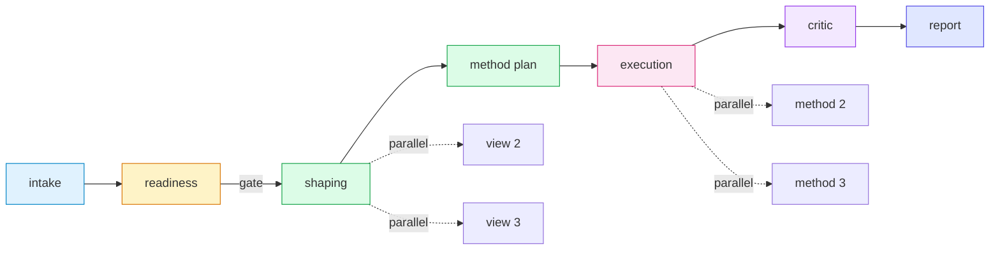

<h1 align="center">Data Scientist</h1>

<p align="center"><i>Cross-platform AI plugin for messy structured data analysis, statistical method planning, manufacturing analytics, and evidence-backed reports.</i></p>

<p align="center">
  <a href="LICENSE"></a>
  <a href="CHANGELOG.md"></a>
  
  
  
  
</p>

---

## ✨ Highlights

- **One skill, eight platforms.** Write the workflow once and run it from Claude Code, Codex, Cursor, OpenCode, Cline, Windsurf, GitHub Copilot, or Gemini CLI.
- **7-stage staged orchestration.** Intake → readiness → shaping → method planning → execution → critic → report, with explicit parallel fan-out patterns on platforms that support multi-agent dispatch.
- **Three-tier evidence framework.** Reliable conclusions, directional signals, and unsupported findings are reported separately and never blurred together.
- **Manufacturing-grade reference library.** SPC, Cp/Cpk, MSA, DOE, yield-driver analysis, and 7 recipes baked into the skill — not bolted on.

---

## 🚀 Quick start

1. **Pick your tool** from the [supported platforms](#-supported-platforms) below.
2. **Install the plugin** following the 2-minute guide in [INSTALL.md](INSTALL.md) for your tool.
3. **Run the workflow** against a dataset.

```bash
# Claude Code — primary entrypoint
git clone https://github.com/your-org/data_scientist.git
ln -s "$PWD/data_scientist/plugins/data-scientist" "$HOME/.claude/plugins/data-scientist"
```

```text
# In Claude Code, then:
/ds-analyze data/my_dataset.csv
```

On platforms without slash commands, invoke the skill by name:

```text
Run the data-scientist skill on data/my_dataset.csv
```

The first pass returns a profile + readiness check; subsequent stages plan methods, execute analysis, and produce a report with limitations.

---

## 🧩 Supported platforms

**Native skill + subagent dispatch** (full feature set):

| Platform | Skill | Subagents | Slash commands |
|---|:-:|:-:|:-:|
| **Claude Code** | ✅ | ✅ native parallel | ✅ |
| **Codex** | ✅ | ⚠️ sequential | ✅ |
| **OpenCode** | ✅ | ⚠️ sequential | ✅ |

**Rules-based integration** (skill content surfaced as project rules):

| Platform | Entrypoint | Auto-activates on |
|---|---|---|
| **Cursor** | `.cursor/rules/data-scientist.mdc` | data file globs |
| **Cline** | `.clinerules/data-scientist.md` | manual rule load |
| **Windsurf** | `.windsurf/rules/data-scientist.md` | data file globs |
| **GitHub Copilot** | `.github/copilot-instructions.md` | repo presence |
| **Gemini CLI** | `GEMINI.md` | session start |

Legend: ✅ first-class · ⚠️ partial (works, fewer affordances)

---

## 📦 Install

Pick your tool below — each has a 2-minute install path documented in **[INSTALL.md](INSTALL.md)**.

| Platform | Entrypoint | Install guide |
|---|---|---|
| Claude Code | `.claude-plugin/plugin.json` | [→ INSTALL.md#claude-code](INSTALL.md#claude-code) |
| Codex | `.codex-plugin/plugin.json` | [→ INSTALL.md#codex](INSTALL.md#codex) |
| Cursor | `.cursor/rules/data-scientist.mdc` | [→ INSTALL.md#cursor](INSTALL.md#cursor) |
| OpenCode | `.opencode/plugins/data-scientist.js` | [→ INSTALL.md#opencode](INSTALL.md#opencode) |
| Cline | `.clinerules/data-scientist.md` | [→ INSTALL.md#cline](INSTALL.md#cline) |
| Windsurf | `.windsurf/rules/data-scientist.md` | [→ INSTALL.md#windsurf](INSTALL.md#windsurf) |
| GitHub Copilot | `.github/copilot-instructions.md` | [→ INSTALL.md#github-copilot](INSTALL.md#github-copilot) |
| Gemini CLI | `GEMINI.md` | [→ INSTALL.md#gemini-cli](INSTALL.md#gemini-cli) |

---

## ⚙️ How it works



**7 stages, parallelizable where dependencies allow.**

Stages connected by dotted lines can fan out to parallel subagents on platforms that natively dispatch sub-agents (Claude Code). On other platforms the same role runs sequentially without changing the artifact JSON contract. See [`references/multi-agent-orchestration.md`](plugins/data-scientist/skills/analysis-workflow/references/multi-agent-orchestration.md) for state-passing schemas and per-platform fan-out patterns.

---

## 🛠️ Use cases

- **Manufacturing yield-driver analysis.** Rank process variables by their influence on yield, separate confirmed drivers from confounded signals, recommend confirmation experiments.
- **Process parameter → defect rate.** Regression and SPC on noisy line data, with Cp/Cpk and capability commentary.
- **Equipment time-series anomaly detection.** Decompose seasonality, surface change-points, filter alarm storms.
- **A/B / experiment sanity check.** Pre-flight assumptions, run the right test, report effect size with confidence bands and caveats.

---

## 📊 What's inside

- **1 skill** — `data-scientist` end-to-end workflow with bundled scripts and references
- **7 staged subagents** — intake, readiness, shaping, method planner, execution, critic, report
- **4 slash commands** — `/ds-profile`, `/ds-plan`, `/ds-analyze`, `/ds-report`
- **11 method groups** in the method registry
- **8 readiness dimensions** in the data-readiness rubric
- **32 charts** catalogued with selection guidance
- **7 manufacturing recipes** in the playbook
- **3 golden templates** for common report shapes
- **145 tests** in the pytest suite

---

## 📚 Repository layout

```
data_scientist/
├── plugins/data-scientist/
│   ├── .claude-plugin/        # Claude Code manifest
│   ├── .codex-plugin/         # Codex manifest
│   ├── .cursor/rules/         # Cursor auto-activating rule
│   ├── .opencode/plugins/     # OpenCode plugin entry
│   ├── .clinerules/           # Cline workspace rules
│   ├── .windsurf/rules/       # Windsurf workspace rules
│   ├── .github/               # GitHub Copilot instructions
│   ├── GEMINI.md              # Gemini CLI memory
│   ├── agents/                # 7 staged subagents
│   ├── commands/              # 4 slash commands
│   └── skills/analysis-workflow/
│       ├── SKILL.md
│       ├── references/        # workflow, method-registry, chart-catalog, ...
│       ├── scripts/           # profile_dataset.py, ds_skill/
│       └── assets/            # report_template.md
├── tests/                     # pytest suite
├── INSTALL.md
├── CHANGELOG.md
├── LICENSE
└── README.md
```

---

## 🧪 Local development

```bash
# Run the test suite
npm test                       # → pytest tests

# Profile a dataset without an assistant in the loop
npm run profile -- path/to/data.csv
# or directly:
python plugins/data-scientist/skills/analysis-workflow/scripts/profile_dataset.py path/to/data.csv
```

Tests live in [`tests/`](tests/). Scratch work belongs in `.local/` (git-ignored).

---

## 🗺️ Roadmap

- More golden templates — logistics, finance, web analytics
- MCP server wrapper so the skill's helpers can be exposed as native tools
- Native Claude Code marketplace publication
- Quality and coverage CI on the pytest suite

---

## 🤝 Contributing

Issues and PRs welcome. The highest-leverage contributions are: new entries in the method registry, new golden templates for under-served domains, and new platform integrations. A full contributing guide is on the way — see [CONTRIBUTING.md](CONTRIBUTING.md) (coming soon).

---

## 📄 License

MIT — see [LICENSE](LICENSE).
